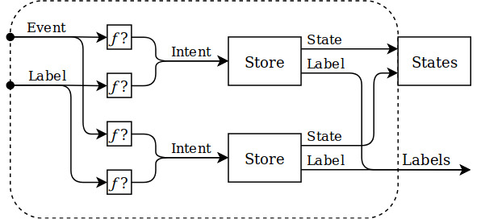

## Component

What if you are developing a complete business logic of something,
you might have more than one `Store`. Let's say you are implementing a
business logic of some screen. In this case it's very useful to provide
some single entry point to your screen (or any other complete business
logic) so its clients do not need to care about implementation details
(a number of `Stores` and connections between them). That's why we
need `Components`. Event you have just one single `Store` it's still
might be useful to expose a `Component` to clients instead of `Store`.

To better understand what is `Component` and how it works look at the
following picture:



As you can see `Component` wires `Stores` together. On the left side it
accepts `Events` from outside, converts them to `Intents` using `Mapper`
functions and delegates to appropriate `Stores`. And on the right side
it provides `States` object that usually holds `Observables` of all
`Stores` of `Component` (however it can be any type).

In MVIDroid `Component` is represented by `MviComponent` interface:
```kotlin
interface MviComponent<in Event : Any, out States : Any> : Disposable {

    @get:MainThread
    val states: States

    @MainThread
    fun accept(event: Event)

    @MainThread
    override fun dispose()

    @MainThread
    override fun isDisposed(): Boolean
}
```

Here you can find:
* `states` field that provides access to `States` object
* `accept(Event)` method to send `Events` to a `Component`
* `Component` extends `Disposable` interface so you can dispose
`Component` and all its `Stores`

Let's say we are implementing some sort of user info screen. Following
Single Responsibility Principle (SRP) we could have two `Stores`:
```kotlin
data class UserInfoState(
    val id: String,
    val name: String?,
    val about: String?,
    val isLoading: Boolean
)

interface UserInfoStore : MviStore<UserInfoState, UserInfoStore.Intent, Nothing> {
    sealed class Intent {
        object Refresh: Intent()
        class ApplyName(val name: String) : Intent()
        class ApplyAbout(val about: String) : Intent()
    }
}

data class UserEditState(
    val isSaving: Boolean
)

interface UserEditStore : MviStore<UserEditState, UserEditStore.Intent, UserEditStore.Label> {
    sealed class Intent {
        class ChangeName(val name: String) : Intent()
        class ChangeAbout(val about: String) : Intent()
    }

    sealed class Label {
        class NameChanged(val name: String) : Label()
        class AboutChanged(val about: String) : Label()
    }
}
```

`UserInfoStore` is responsible for loading data and providing it as
`UserInfoState`. It also updates its `State` with new data.
`UserEditStore` is responsible for updating user's fields on
server/database and notifying other `Stores` about it.

First we need do define `Events` and `States` for our `Component`:
```kotlin
sealed class UserInfoEvent {
    class OnChangeName(val name: String) : UserInfoEvent()
    class OnChangeAbout(val about: String) : UserInfoEvent()
}

class UserInfoStates(
    val userInfoStates: Observable<out UserInfoState>,
    val userEditStates: Observable<out UserEditState>
)
```

`UserInfoEvent` class enums all our `Events` and `UserInfoStates`
class holds `States` of all our `Stores.

Now let's create a factory of our `Component`:
```kotlin
class UserInfoComponentFactory {

    fun create(): MviComponent<UserInfoEvent, UserInfoStates> {
        val userInfoStore: UserInfoStore = ..
        val userEditStore: UserEditStore = ..

        return Component(
            userInfoStore = userInfoStore,
            userEditStore = userEditStore,
            labels = PublishRelay.create<Any>()
        )
    }

    private class Component(
        userInfoStore: UserInfoStore,
        userEditStore: UserEditStore,
        labels: Relay<Any>
    ) : MviAbstractComponent<UserInfoEvent, UserInfoStates, Relay<Any>>(
        stores = listOf(
            userInfoStore.toBundle(eventMapper = UserInfoStoreEventMapper, labelMapper = UserInfoStoreLabelMapper),
            userEditStore.toBundle(eventMapper = UserEditStoreEventMapper)
        ),
        labels = labels
    ) {
        override val states: UserInfoStates =
            UserInfoStates(
                userInfoStates = userInfoStore.states,
                userEditStates = userEditStore.states
            )
    }

    private object UserInfoStoreEventMapper : (UserInfoEvent) -> UserInfoStore.Intent? {
        override fun invoke(event: UserInfoEvent): UserInfoStore.Intent? =
            when (event) {
                UserInfoEvent.OnRefresh -> UserInfoStore.Intent.Refresh
                else -> null
            }
    }

    private object UserInfoStoreLabelMapper : (Any) -> UserInfoStore.Intent? {
        override fun invoke(label: Any): UserInfoStore.Intent? =
            when (label) {
                is UserEditStore.Label.NameChanged -> UserInfoStore.Intent.ApplyName(label.name)
                is UserEditStore.Label.AboutChanged -> UserInfoStore.Intent.ApplyName(label.about)
                else -> null
            }
    }

    private object UserEditStoreEventMapper : (UserInfoEvent) -> UserEditStore.Intent? {
        override fun invoke(event: UserInfoEvent): UserEditStore.Intent? =
            when (event) {
                is UserInfoEvent.OnChangeName -> UserEditStore.Intent.ChangeName(event.name)
                is UserInfoEvent.OnChangeAbout -> UserEditStore.Intent.ChangeAbout(event.about)
                else -> null
            }
    }
}
```

There is an abstract implementation of `MviComponent` interface called
`MviAbstractComponent` which we have extended. For every `Store` in
`Component` we need to provide `MviStoreBundle` containing `Store` itself
plus optional `Event Mapper` and/or `Label Mapper`. Every `Event Mapper`
converts a subset of `Events` of `Component` to `Intents` of a particular
`Store`. And every `Label Mapper` converts a subset of `Labels` from
other `Stores` to `Intents` of a particular `Store`.

We have create a single entry point to our business logic.

---
[Previous](store.md) [Index](index.md) [Next](view.md)
