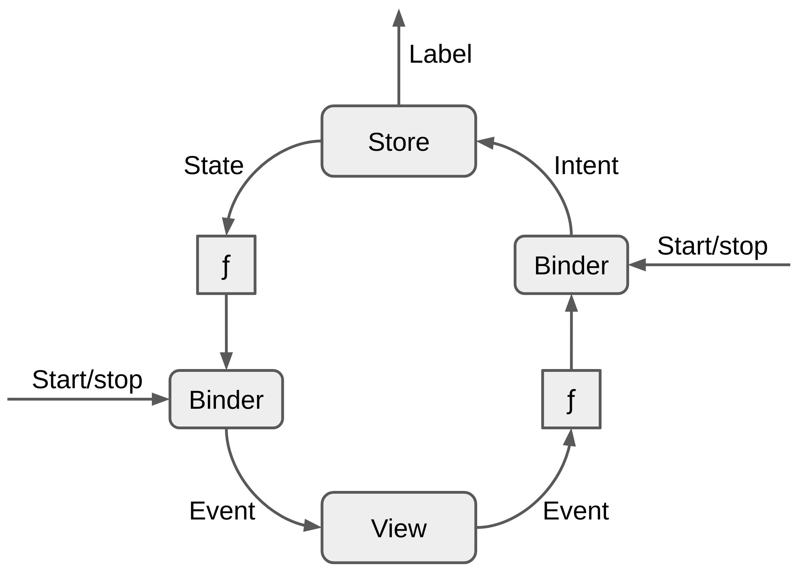
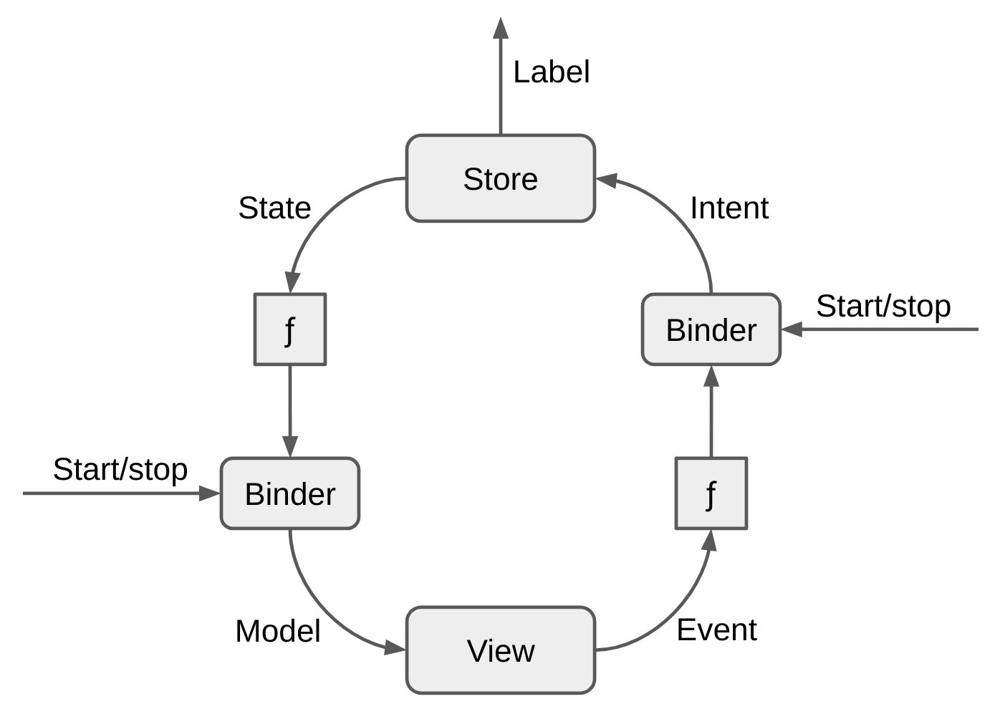

Overview | [Store](store.md) | [View](view.md) | [Binding and Lifecycle](binding_and_lifecycle.md) | [State preservation](state_preservation.md) | [Logging](logging.md) | [Time travel](time_travel.md)

## Overview

### What is MVI

MVI stands for Model-View-Intent. It is an architectural pattern that utilizes unidirectional data flow. The data circulates between `Model` and `View` only in one direction - from `Model` to `View` and from `View` to `Model`.

### What is MVIKotlin

MVIKotlin is a Kotlin Multiplatform framework that provides a way of (not only) writing shared code using MVI pattern. It also includes powerful debug tools like logging and time travel.

#### Responsibility
MVIKotlin does not bring or enforce any particular architecture. Its responsibility can be described as follows:

- To provide a single source of truth for `State` (the scope is not defined, it can be a whole app, a screen, a feature, or a part of a feature);
- To provide an abstraction for UI with efficient updates (however this is not obligatory, you can use whatever you want);
- To provide lifecycle-aware connections (binding) between inputs and outputs (again this is not obligatory in any way).

Everything else is out of scope of the library, there are no definitions for "screens", "features", "modules", etc. Also, no particular reactive framework is enforced/exposed. This gives a lot of flexibility:

- MVIKotlin can be introduced incrementally (e.g. you can start using it in a small feature and then expand gradually);
- You can use/experiment with different architectures, approaches and/or libraries for navigation, UI, modularization, etc;
- Use whatever reactive framework you like or don't use it at all.

You can find one of the architecture options in the [samples](https://github.com/arkivanov/MVIKotlin/tree/master/sample). Again, this is just an example of one possible solution.

### Core components

There are two core components in MVIKotlin: 

- `Store` - represents `Model` from MVI, this is the place for business logic
- `MviView` - represents `View` from MVI, the UI part, optional

### How the data flows

Please take a look at the following diagram:

The `Store` produces a stream of `States` which is transformed to a stream of `View Models` by a `Mapper` function (f). The `View` renders `View Models` and produces a stream of `View Events` which is transformed to a stream of `Intents` by another `Mapper` function (f). This makes the `Store` and the `View` independent from each other. You can also combine multiple `States` (multiple `Stores`) into a single `View Model` (single `View`), or multiple `View Events` (multiple `Views`) into a single `Intent` (single `Store`). But if you have only one `Store` and only one `View` and you need simplicity then your `View` can directly render `States` and produce `Intents`.

The `View` is subscribed to the stream of `View Models` and the `Store` is subscribed to the stream of `Intents` by a `Binder`. The `Binder` accepts `start` and `stop` signals and manages the subscriptions. The `Binder` is optional, you can subscribe components as you like. 

The `Store` also produces a stream of `Labels` - one time events. They can be transformed to `Intents` and redirected to another `Stores`. Or you can use them for routing or to display errors or for any other actions that are not so important to be part of the `State`.

The data flows between core components only on Main thread.

### Reactivity

MVI loves reactivity, it's all about data streams and transformations. MVIKotlin is a reactive framework. But the main functionality of the framework does not depend on any such library. A tiny abstraction over Rx is used instead. Extensions for [Reaktive](https://github.com/badoo/Reaktive) and for [Coroutines](https://github.com/Kotlin/kotlinx.coroutines) libraries are provided as separate modules.

### Kotlin/Native

MVIKotlin is Kotlin/Native friendly and supports its tricky memory model (please read about Kotlin/Native [concurrency](https://kotlinlang.org/docs/reference/native/concurrency.html) and [immutability](https://kotlinlang.org/docs/reference/native/immutability.html) if you are unsure).

`Stores` are freezable, however you should be careful not to freeze any dependency that is not intended to be frozen. When you subscribe to a `Store` the subscriber will not be frozen, unless you switch threads somewhere down the stream.

Overview | [Store](store.md) | [View](view.md) | [Binding and Lifecycle](binding_and_lifecycle.md) | [State preservation](state_preservation.md) | [Logging](logging.md) | [Time travel](time_travel.md)
