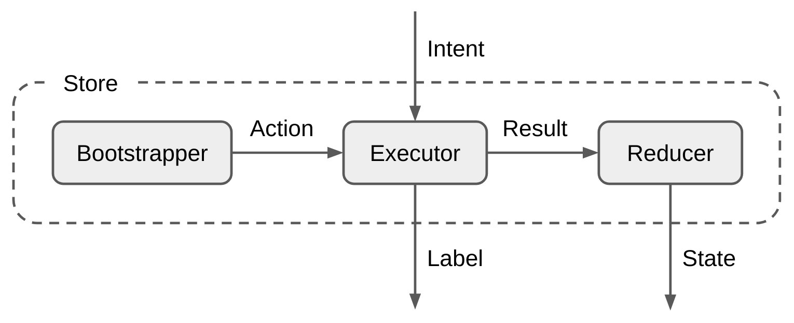

[Overview](index.md) | Store | [View](view.md) | [Binding and Lifecycle](binding_and_lifecycle.md) | [State preservation](state_preservation.md) | [Logging](logging.md) | [Time travel](time_travel.md)

## Store

`Store` is the place for business logic. In MVIKotlin it is represented by the `Store` interface which is located in the `mvikotlin` module. You can check its definition [here](https://github.com/arkivanov/MVIKotlin/blob/master/mvikotlin/src/commonMain/kotlin/com/arkivanov/mvikotlin/core/store/Store.kt).

It has the following features:

- There are three generic parameters: input `Intent` and output `State` and `Label`.
- The property named `state` returns the current `State` of the `Store`.
- Can be instantiated (created) on any thread.
- Its `states(Observer<State>)` method is used to subscribe for `State` updates. When subscribed it emits the current `State` of the `Store`. Can be called (subscribed) on any thread, `States` are emitted always on the main thread.
- The `labels(Observer<Label>)` method is used to subscribe for `Labels`. Can be called (subscribed) on any thread, `Labels` are emitted always on the main thread.
- The `accept(Intent)`  method supplies the `Store` with the `Intents`, must be called only on the main thread.
- The `init()` method initializes the `Store` and triggers the `Bootstrapper` if applicable, must be called only on the main thread.
- The `dispose()` method disposes the `Store` and cancels all its async operations, must be called only on the main thread.

> ⚠️ Usually you don't need to use `states(Observer)` or `labels(Observer)` methods directly. There are extensions available for `Reaktive` and `kotlinx.coroutines` libraries (see [Binding and Lifecycle](binding_and_lifecycle.md) for more information). However you will need these methods if you implement custom extensions.

Every `Store` has up to three components: `Bootstrapper`, `Executor` and `Reducer`. Here is the diagram of how they are connected:



### Bootstrapper

This component bootstraps (kick-starts) the `Store`. If passed to the `StoreFactory` it will be called at some point during `Store` initialization. The `Bootstrapper` produces `Actions` that are processed by the `Executor`. The `Bootstrapper` is executed always on the main thread, `Actions` must be also dispatched only on the main thread. However you are free to switch threads while the `Bootstrapper` is being executed.

> ⚠️ Please note that `Bootstrappers` are stateful and so can not be `object`s (singletons).

### Executor

This is the place for business logic, all asynchronous operations also happen here. `Executor` accepts and processes `Intents` from the outside world and `Actions` from the `Bootstrapper`. The `Executor` has two outputs: `Messages` and `Labels`. `Messages` are passed to the `Reducer`, `Labels` are emitted straight to the outside world. The `Executor` has constant access to the current `State` of the `Store`, a new `State` is visible for the `Executor` right after the `Message` is dispatched. The `Executor` is executed always on the main thread, `Messages` and `Labels` must be also dispatched only on the main thread. However you are free to switch threads while processing `Action` or `Intents`.

> ⚠️ Please note that `Executors` are stateful and so can not be `object`s (singletons).

### Reducer

This component is basically a function that accepts a `Message` from the `Executor` and the current `State` of the `Store` and returns a new `State`. The `Reducer` is called for every `Message` produced by the `Executor` and the new `State` is applied and emitted as soon as the `Reducer` call returns. The `Reducer` is always called on the main thread.

## Creating a Store

Normally you don't need to implement the `Store` interface directly. Instead you should use [StoreFactory](https://github.com/arkivanov/MVIKotlin/blob/master/mvikotlin/src/commonMain/kotlin/com/arkivanov/mvikotlin/core/store/StoreFactory.kt) which will create a `Store` for you. All you need to do is to provide up to three components (`Bootstrapper`, `Executor` and `Reducer`) and an initial `State`. `StoreFactory` is used to abstract from a `Store` implementation. We can use different factories depending on circumstances and combine them as needed.

There are a number of factories provided by MVIKotlin:
- [DefaultStoreFactory](https://github.com/arkivanov/MVIKotlin/blob/master/mvikotlin-main/src/commonMain/kotlin/com/arkivanov/mvikotlin/main/store/DefaultStoreFactory.kt) creates a default implementation of `Store` and is provided by the `mvikotlin-main` module.
- [LoggingStoreFactory](https://github.com/arkivanov/MVIKotlin/blob/master/mvikotlin-logging/src/commonMain/kotlin/com/arkivanov/mvikotlin/logging/store/LoggingStoreFactory.kt) wraps another `StoreFactory` and adds logging, it's provided by the `mvikotlin-logging` module.
- [TimeTravelStoreFactory](https://github.com/arkivanov/MVIKotlin/blob/master/mvikotlin-timetravel/src/commonMain/kotlin/com/arkivanov/mvikotlin/timetravel/store/TimeTravelStoreFactory.kt) is provided by the `mvikotlin-timetravel` module, it creates a `Store` with time travel functionality.

### Initializing a Store

By default `Stores` are initialized automatically by the `StoreFactory`. You can opt-out from the automatic initialization by passing `isAutoInit=false` argument to the `StoreFactory.create(...)` function.

> ⚠️ When automatic initialization is disabled, you should manually call the `Store.init()` method.

### IDEA Live Templates

To speed up the creation of new Stores, you can use the following [IDEA Live Templates](https://gist.github.com/arkivanov/34bb84e73e56c22a4e7c752421d5f02c).

### Simplest example

Let's start from a very basic example. We will create a simple counter `Store` that will increment and decrement its value.

The first thing we should do is to define an interface. This is how it will look:

```kotlin
internal interface CalculatorStore : Store<Intent, State, Nothing> {

    sealed class Intent {
        object Increment : Intent()
        object Decrement : Intent()
    }

    data class State(
        val value: Long = 0L
    )
}
```

The `CalculatorStore` interface itself can be marked as `internal`, so it will be an implementation detail of a module. Also `CalculatorStore` has two `Intents` (`Increment` and `Decrement`) and the `State` with just a `Long` value. This is the public API of our `Store`.

Now it's time for implementation:

```kotlin
internal class CalculatorStoreFactory(private val storeFactory: StoreFactory) {

    fun create(): CalculatorStore =
        object : CalculatorStore, Store<Intent, State, Nothing> by storeFactory.create(
            name = "CounterStore",
            initialState = State(),
            reducer = ReducerImpl
        ) {
        }

    private object ReducerImpl : Reducer<State, Intent> {
        override fun State.reduce(msg: Intent): State =
            when (msg) {
                is Intent.Increment -> copy(value = value + 1L)
                is Intent.Decrement -> copy(value = value - 1L)
            }
    }
}
```

The only component we need is the `Reducer`. It accepts `Intents` and modifies the `State` by incrementing or decrementing its value. The factory function `create()` uses the `StoreFactory` which is passed as a dependency.

### Adding Executor

Currently our `CalculatorStore` can only increment and decrement its value. But what if we need to calculate something? Let's say we want to calculate a sum of numbers from 1 to N. We will need an additional `Intent`:

```kotlin
internal interface CalculatorStore : Store<Intent, State, Nothing> {

    sealed class Intent {
        object Increment : Intent()
        object Decrement : Intent()
        data class Sum(val n: Int): Intent() // <-- Add this line
    }

    data class State(
        val value: Long = 0L
    )
}
```

The idea is that `CalculatorStore` will accept `Intent.Sum(N)`, calculate the sum of numbers from 1 to N and update the `State` with the result. But the calculation may take some time, so it should be performed on a background thread. For this we need the `Executor`.

So that our `Executor` could communicate with the `Reducer` we will need `Messages`:

```kotlin
internal class CalculatorStoreFactory(private val storeFactory: StoreFactory) {

    private sealed class Msg {
        class Value(val value: Long) : Msg()
    }
}
```

We will need a new `Reducer` because now it will accept `Messages` instead of `Intents`:

```kotlin
internal class CalculatorStoreFactory(private val storeFactory: StoreFactory) {

    private sealed class Msg {
        class Value(val value: Long) : Msg()
    }

    private object ReducerImpl : Reducer<State, Msg> {
        override fun State.reduce(msg: Msg): State =
            when (msg) {
                is Msg.Value -> copy(value = msg.value)
            }
    }
}
```

There is only one possible `Msg.Value(Long)` which just replaces whatever value in `State`.

Now it's time for the `Executor`. If you are interested you can find the interface [here](https://github.com/arkivanov/MVIKotlin/blob/master/mvikotlin/src/commonMain/kotlin/com/arkivanov/mvikotlin/core/store/Executor.kt). Luckily we don't need to implement this entire interface. Instead we can extend a base implementation.

There are two base `Executors` provided by `MVIKotlin`:

- [ReaktiveExecutor](https://github.com/arkivanov/MVIKotlin/blob/master/mvikotlin-extensions-reaktive/src/commonMain/kotlin/com/arkivanov/mvikotlin/extensions/reaktive/ReaktiveExecutor.kt) - this implementation is based on the [Reaktive](https://github.com/badoo/Reaktive) library and is provided by `mvikotlin-extensions-reaktive` module
- [CoroutineExecutor](https://github.com/arkivanov/MVIKotlin/blob/master/mvikotlin-extensions-coroutines/src/commonMain/kotlin/com/arkivanov/mvikotlin/extensions/coroutines/CoroutineExecutor.kt) - this implementation is based on the [Coroutines](https://github.com/Kotlin/kotlinx.coroutines) library and is provided by `mvikotlin-extensions-coroutines` module

Let's try both.

#### ReaktiveExecutor

```kotlin
internal class CalculatorStoreFactory(private val storeFactory: StoreFactory) {

    // ...

    private class ExecutorImpl : ReaktiveExecutor<Intent, Nothing, State, Msg, Nothing>() {
        override fun executeIntent(intent: Intent, getState: () -> State) =
            when (intent) {
                is Intent.Increment -> dispatch(Msg.Value(getState().value + 1))
                is Intent.Decrement -> dispatch(Msg.Value(getState().value - 1))
                is Intent.Sum -> sum(intent.n)
            }

        private fun sum(n: Int) {
            singleFromFunction { (1L..n.toLong()).sum() }
                .subscribeOn(computationScheduler)
                .map(Msg::Value)
                .observeOn(mainScheduler)
                .subscribeScoped(onSuccess = ::dispatch)
        }
    }

    // ...
}
```

So we extended the `ReaktiveExecutor` class and implemented the `executeIntent` method. This method gives us an `Intent` and a supplier of the current `State`. For `Intent.Increment` and `Intent.Decrement` we simply send the `Message` with a new value using the `dispatch` method. But for `Intent.Sum` we use `Reaktive` for multithreading. We calculate the sum on the `computationScheduler` and then switch to the `mainScheduler` and `dispatch` the `Message`.

> ⚠️ `ReaktiveExecutor` implements Reaktive's [DisposableScope](https://github.com/badoo/Reaktive#subscription-management-with-disposablescope) which provides a bunch of additional extension functions. We used one of those functions - `subscribeScoped`. This ensures that the subscription is disposed when the `Store` (and so the `Executor`) is disposed.

#### CoroutineExecutor

```kotlin
internal class CalculatorStoreFactory(private val storeFactory: StoreFactory) {

    // ...

    private class ExecutorImpl : CoroutineExecutor<Intent, Nothing, State, Msg, Nothing>() {
        override fun executeIntent(intent: Intent, getState: () -> State) =
            when (intent) {
                is Intent.Increment -> dispatch(Msg.Value(getState().value + 1))
                is Intent.Decrement -> dispatch(Msg.Value(getState().value - 1))
                is Intent.Sum -> sum(intent.n)
            }

        private fun sum(n: Int) {
            scope.launch {
                val sum = withContext(Dispatchers.Default) { (1L..n.toLong()).sum() }
                dispatch(Msg.Value(sum))
            }
        }
    }

    // ...
}
```

Here we extended the `CoroutineExecutor` class. The sum is calculated on the `Default` dispatcher and the `Message` is dispatched on the `Main` thread.

> ⚠️ `CoroutineExecutor` provides the `CoroutineScope` property named `scope`, which can be used to run asynchronous tasks. The scope uses `Dispatchers.Main` dispatcher by default, which can be overriden by passing different `CoroutineContext` to the `CoroutineExecutor` constructor. The scope is automatically cancelled when the `Store` is disposed.

#### Publishing Labels

`Labels` are one-time events produced by the `Store`, or more specifically by the `Executor`. Once published (emitted) they are delivered to all current subscribers and are not cached. The `Executor` has special method for it: `publish(Label)`.

### Creating the Store

We also need to pass a factory of our `Executor` to the `StoreFactory`:

```kotlin
internal class CalculatorStoreFactory(private val storeFactory: StoreFactory) {

    fun create(): CalculatorStore =
        object : CalculatorStore, Store<Intent, State, Nothing> by storeFactory.create(
            name = "CounterStore",
            initialState = State(),
            executorFactory = ::ExecutorImpl, // <-- Pass Executor factory
            reducer = ReducerImpl
        ) {
        }

    // ...
}
```

Why factory and not just an instance of the `Executor`? Because of the time travel feature. When debugging time travel events it creates separate instances of `Executors` when necessary and fakes their `States`.

### Adding Bootstrapper

When we create a new instance of a `Store` it will stay in an initial `State` and do nothing until you supply an `Intent`. But sometimes we need to bootstrap (or kick start) a `Store` so it will start doing something once created. E.g. it can start listening for events from a server or load something from a database. This is why we need the `Bootstrapper`. As mentioned in the beginning the `Bootstrapper` produces `Actions` that are processed by the `Executor` the same way as `Intents`.

Our `CalculatorStore` is able to calculate sums of numbers from 1 to N. Currently it does this when `Intent.Sum(N)` is received. Let's use the `Bootstrapper` to calculate `sum(100)` when the `CalculatorStore` is created. Our `Executor` already has everything to for sum calculation, so we can just send a triggering `Action` to the `Executor`, same as `Intent.Sum(N)`.

Let's first add an `Action`:

```kotlin
internal class CalculatorStoreFactory(private val storeFactory: StoreFactory) {

    // ...

    private sealed class Action {
        class Sum(val n: Int): Action()
    }

    // ...
}
```

Now it's time to handle the `Action` in the `ReaktiveExecutor`:

```kotlin
internal class CalculatorStoreFactory(private val storeFactory: StoreFactory) {

    // ...

    private class ExecutorImpl : ReaktiveExecutor<Intent, Action, State, Msg, Nothing>() {
        override fun executeAction(action: Action, getState: () -> State) =
            when (action) {
                is Action.Sum -> sum(action.n)
            }

        // ...
    }

    // ...
}
```

And same for the `CoroutineExecutor`:

```kotlin
internal class CalculatorStoreFactory(private val storeFactory: StoreFactory) {

    // ...

    private class ExecutorImpl : CoroutineExecutor<Intent, Action, State, Msg, Nothing>() {
        override fun executeAction(action: Action, getState: () -> State) =
            when (action) {
                is Action.Sum -> sum(action.n)
            }

        // ...
    }

    // ...
}
```

The only thing is missing is we need to somehow trigger the `Action`. We need to pass a `Bootstrapper` to the `StoreFactory`. For such a simple case we can use ['SimpleBootstrapper`](https://github.com/arkivanov/MVIKotlin/blob/master/mvikotlin/src/commonMain/kotlin/com/arkivanov/mvikotlin/core/store/SimpleBootstrapper.kt):

```kotlin
internal class CalculatorStoreFactory(private val storeFactory: StoreFactory) {

    fun create(): CalculatorStore =
        object : CalculatorStore, Store<Intent, State, Nothing> by storeFactory.create(
            name = "CounterStore",
            initialState = State(),
            bootstrapper = SimpleBootstrapper(Action.Sum(100)), // <-- Add this line
            executorFactory = ::ExecutorImpl,
            reducer = ReducerImpl
        ) {
        }

    // ...
}
```

The `SimpleBootstrapper` just dispatches the provided `Actions`. But sometimes we need more, e.g. do some background work:

Using `ReaktiveBootstrapper` from the `mvikotlin-extensions-reaktive` module:

```kotlin
internal class CalculatorStoreFactory(private val storeFactory: StoreFactory) {

    fun create(): CalculatorStore =
        object : CalculatorStore, Store<Intent, State, Nothing> by storeFactory.create(
            name = "CounterStore",
            initialState = State(),
            bootstrapper = BootstrapperImpl, // <-- Pass BootstrapperImpl to the StoreFactory
            executorFactory = ::ExecutorImpl,
            reducer = ReducerImpl
        ) {
        }

    private sealed class Action {
        class SetValue(val value: Long): Action() // <-- Use another Action
    }

    // ...

    private class BootstrapperImpl : ReaktiveBootstrapper<Action>() {
        override fun invoke() {
            singleFromFunction { (1L..1000000.toLong()).sum() }
                .subscribeOn(computationScheduler)
                .map(Action::SetValue)
                .observeOn(mainScheduler)
                .subscribeScoped(onSuccess = ::dispatch)
        }
    }

    private class ExecutorImpl : ReaktiveExecutor<Intent, Action, State, Msg, Nothing>() {
        override fun executeAction(action: Action, getState: () -> State) =
            when (action) {
                is Action.SetValue -> dispatch(Msg.Value(action.value)) // <-- Handle the Action
            }

        // ...
    }

    // ...
}
```

> ⚠️ `ReaktiveBootstrapper` also implements `DisposableScope`, same as `ReaktiveExecutor`. So we can use `subscribeScoped` extension functions here as well.

Using `CoroutineBootstrapper` from the `mvikotlin-extensions-coroutines` module:

```kotlin
internal class CalculatorStoreFactory(private val storeFactory: StoreFactory) {

    fun create(): CalculatorStore =
        object : CalculatorStore, Store<Intent, State, Nothing> by storeFactory.create(
            name = "CounterStore",
            initialState = State(),
            bootstrapper = BootstrapperImpl,
            executorFactory = ::ExecutorImpl,
            reducer = ReducerImpl
        ) {
        }

    private sealed class Action {
        class SetValue(val value: Long): Action()
    }

    // ...

    private class BootstrapperImpl : CoroutineBootstrapper<Action>() {
        override fun invoke() {
            scope.launch {
                val sum = withContext(Dispatchers.Default) { (1L..1000000.toLong()).sum() }
                dispatch(Action.SetValue(sum))
            }
        }
    }

    private class ExecutorImpl : CoroutineExecutor<Intent, Action, State, Msg, Nothing>() {
        override fun executeAction(action: Action, getState: () -> State) =
            when (action) {
                is Action.SetValue -> dispatch(Msg.Value(action.value))
            }

        // ...
    }

    // ...
}
```

> ⚠️ `CoroutineBootstrapper` also provides the `CoroutineScope` property named `scope`, same as `CoroutineExecutor`. So we can use it run asynchronous tasks.

[Overview](index.md) | Store | [View](view.md) | [Binding and Lifecycle](binding_and_lifecycle.md) | [State preservation](state_preservation.md) | [Logging](logging.md) | [Time travel](time_travel.md)
