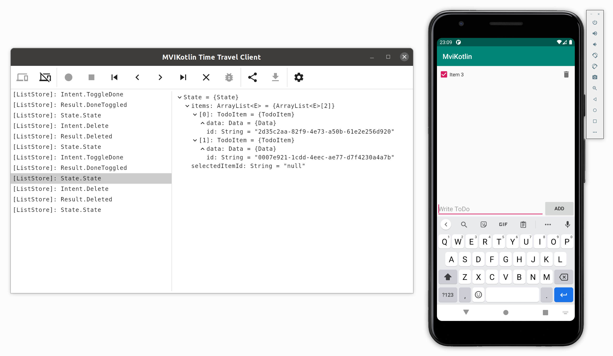

[Overview](index.md) | [Store](store.md) | [View](view.md) | [Binding and Lifecycle](binding_and_lifecycle.md) | [State preservation](state_preservation.md) | [Logging](logging.md) | Time travel

## Time travel

Time travel is a power debugging tool. Basically it allows you to record all events and states from all active `Stores`. When events are recorded you can explore them, replay and debug. The core functionality is multiplatform and is available for all supported targets.

If you want to use the time travel tool you have to use the [TimeTravelStoreFactory](https://github.com/arkivanov/MVIKotlin/blob/master/mvikotlin-timetravel/src/commonMain/kotlin/com/arkivanov/mvikotlin/timetravel/store/TimeTravelStoreFactory.kt).

> ⚠️ Time travel is a debugging tool and may affect performance, ideally it should not be used in production.

### Using TimeTravelStoreFactory

The `TimeTravelStoreFactory` is used to create implementations of `Store` that are able to record and replay events.

Suppose we have the following `Store` factory:

```kotlin
internal class CalculatorStoreFactory(private val storeFactory: StoreFactory) {

    fun create(): CalculatorStore =
        object : CalculatorStore, Store<Intent, State, Nothing> by storeFactory.create(
            name = "CounterStore",
            // ...
        ) {
        }

    // Omitted code
}
```

It accepts a `StoreFactory` and uses it to create an implementation of the `CalculatorStore`. You can now pass any `StoreFactory` here. So if you want to enable time travel just pass an instance of the `TimeTravelStoreFactory`:

```kotlin
val storeFactory = TimeTravelStoreFactory()

CalculatorStoreFactory(storeFactory).create()
```

You can also combine it with the `LoggingStoreFactory` in the following way:

```kotlin
val storeFactory = LoggingStoreFactory(TimeTravelStoreFactory())

CalculatorStoreFactory(storeFactory).create()
```

Normally you should define a global `StoreFactory` somewhere in the main app and pass it down to all the dependencies.

### Time travel UI

You can integrate a special UI into your app which provides controls for time travel and displays a list of recorded events. It is also possible to explore and debug any recorded event. Debugging means you can put a breakpoint in your code and fire a previously recorded event. You can do usual debugging when the breakpoint is triggered.

For Android you can use the [TimeTravelView](https://github.com/arkivanov/MVIKotlin/blob/master/mvikotlin-timetravel/src/androidMain/kotlin/com/arkivanov/mvikotlin/timetravel/widget/TimeTravelView.kt).
For iOS you can copy-paste [TimeTravelViewController](https://github.com/arkivanov/MVIKotlin/blob/master/sample/todo-app-ios/todo-app-ios/TimeTravelViewController.swift) from the sample app.

Check out the following videos demonstrating time travel UI: 
- [Debugging Android application with MVIKotlin](https://youtu.be/_bbxR503-u0)
- [Debugging iOS application with MVIKotlin](https://youtu.be/MJCYQzeL-w8)

Alternatively you can create your own time travel UI. Please refer to [TimeTravelController](https://github.com/arkivanov/MVIKotlin/blob/master/mvikotlin-timetravel/src/commonMain/kotlin/com/arkivanov/mvikotlin/timetravel/controller/TimeTravelController.kt) for more information.

### TimeTravelServer

If using the time travel plugin or desktop app for debugging described later in this document, then the `TimeTravelServer` needs to be running on the application being debugged. The default port of the `TimeTravelServer` is 6379 unless explicitly changed in the application setup.

#### Setup TimeTravelServer Android

First import the time travel dependency in the application module. Replace `<version>` with the latest [release version](https://github.com/arkivanov/MVIKotlin/releases). 

```kotlin
implementation("com.arkivanov.mvikotlin:mvikotlin-timetravel:<version>")
```

In the [`Application`](https://github.com/arkivanov/MVIKotlin/blob/master/sample/todo-app-android/src/main/java/com/arkivanov/mvikotlin/sample/todo/android/App.kt) class, start the `TimeTravelServer` during `onCreate()`. 

```kotlin
class App : Application() {
    private val timeTravelServer = TimeTravelServer()

    override fun onCreate() {
        super.onCreate()
        timeTravelServer.start()
    }
}
```

> ⚠️ Since the `TimeTravelServer` does use the internet on the device for communicating with the development machine, even if the app does not use the internet you will need to declare the uses internet permission in the [AndroidManifest.xml](https://github.com/arkivanov/MVIKotlin/blob/master/sample/todo-app-android/src/main/AndroidManifest.xml#L6).

#### Setup TimeTravelServer JVM 

First import the time travel dependency in the application module. Replace `<version>` with the latest [release version](https://github.com/arkivanov/MVIKotlin/releases). 

```kotlin
implementation("com.arkivanov.mvikotlin:mvikotlin-timetravel:<version>")
```

In the main function of the application, create an instance of the `TimeTravelServer` and implement the `runOnMainThread` property. This can be done with `SwingUtilities.invokeLater {}` or with coroutines if that is implemented. 

```kotlin
val timeTravelServer = TimeTravelServer(runOnMainThread = {
    SwingUtilities.invokeLater(it)
})
timeTravelServer.start()
```

#### Setup TimeTravelServer Apple

To setup the `TimeTravelServer` on an apple device, the `mvikotlin-timetravel` dependency must be exported into the shared module from the [`build.gradle.kts`](https://github.com/arkivanov/MVIKotlin/blob/4e0624946fe24a2fc47ecbfeb35a6fecaf09f709/sample/todo-darwin-umbrella/build.gradle.kts#L27). Also add `mvikotlin-timetravel` as an api dependency in the common source set. Replace `<version>` with the latest [release version](https://github.com/arkivanov/MVIKotlin/releases). 

```kotlin
kotlin {
    ios {
        binaries {
            framework {
                export("com.arkivanov.mvikotlin:mvikotlin-timetravel:<version>")
            }
        }
    }

    sourceSets {
        named("commonMain") {
            dependencies {
                api("com.arkivanov.mvikotlin:mvikotlin-timetravel:<version>")
            }
        }
    }
}
```

Then in the [AppDelegate](https://github.com/arkivanov/MVIKotlin/blob/master/sample/todo-app-ios/todo-app-ios/AppDelegate.swift), create an instance of the `TimeTravelServer` and start in the application launch. 

```swift
@UIApplicationMain
class AppDelegate: UIResponder, UIApplicationDelegate {

    private let s = TimeTravelServer()

    func application(_ application: UIApplication, didFinishLaunchingWithOptions launchOptions: [UIApplication.LaunchOptionsKey: Any]?) -> Bool {
        // Override point for customization after application launch.
        s.start()
        
        return true
    }

}
```

### Time travel plugin for IntelliJ IDEA and Android Studio

There is a more convenient tool for Android - time travel IDEA plugin. This can be used directly from IDE so there is no need to integrate any additional UI.

You will need to run the [TimeTravelServer](https://github.com/arkivanov/MVIKotlin/blob/master/mvikotlin-timetravel/src/androidMain/kotlin/com/arkivanov/mvikotlin/timetravel/server/TimeTravelServer.kt) in your Android app so the plugin could connect to it. Please refer to the [samples](https://github.com/arkivanov/MVIKotlin/tree/master/sample/todo-app-android) for more examples.

#### How to install

You can find the plugin in the IntelliJ IDEA [Marketplace](https://plugins.jetbrains.com/plugin/14241-mvikotlin-time-travel). It can be installed directly from IntelliJ IDEA or Android Studio. Please navigate to Settings -> Plugins -> Marketplace and type "MVIKotlin" in the search field.

#### How to Run

The time travel IntelliJ plugin is only able to connect to an Android device through ADB. 

First be sure to have the `TimeTravelServer` setup and running on the device. Then run the application and open up the time travel plugin in IntelliJ where you can click "Connect" and start recording state changes. 

#### Demo videos

Check out the video demonstrating the time travel IDEA plugin:

[](https://youtu.be/Tr2ayOcVU34)

Check out the video demonstrating how you can export/import the time travel data using the IDEA plugin:

[](https://youtu.be/SIxfSgBkHS0)

### Time travel client app for desktop

This is a standalone time travel client for desktop. It can connect to any application running the `TimeTravelServer`. It can be an Android, or an iOS, or even macOS app.

Check out examples of [iOS app](https://github.com/arkivanov/MVIKotlin/tree/master/sample/todo-app-ios) and [Android app](https://github.com/arkivanov/MVIKotlin/tree/master/sample/todo-app-android) running `TimeTravelServer`.



#### How to install

The time travel client application for desktop is not published yet so you will need to build and run it from [sources](https://github.com/arkivanov/MVIKotlin/tree/master/mvikotlin-timetravel-client/app-desktop). To run the client, run the following command (the minimum JDK version 11 is required):

```
./gradlew :mvikotlin-timetravel-client:app-desktop:run
```

#### How to connect to an Android device

To connect to an Android device with the time travel client, the easiest solution is to simply open the time travel client app settings and check the box to "connect via ADB". Then you should be able link to the device and start recording.

If not using ADB, then go to the device's settings -> about phone and copy the IP address of the phone. Then in the time travel client app settings, uncheck "connect via ADB" and input the IP address of the device. Now link to the device and start recording. 

#### How to connect to an iOS device

To connect the time travel client to an iOS simulator, open up the time travel client settings. Make sure the "Connect via ADB" is unchecked and host is `localhost`. Save the settings and link to the device to start recording. 

If connecting from a physical device, the IP address of the device can be found in Settings -> Wi-Fi -> blue info circle of connected Wi-Fi -> IP Address. 

##### Building a distributable version

The time travel client for desktop is implemented using [Compose for Desktop](https://github.com/JetBrains/compose-jb). So it is possible to assemble a distributable version. Please read the corresponding [documentation page](https://github.com/JetBrains/compose-jb/tree/master/tutorials/Native_distributions_and_local_execution).

[Overview](index.md) | [Store](store.md) | [View](view.md) | [Binding and Lifecycle](binding_and_lifecycle.md) | [State preservation](state_preservation.md) | [Logging](logging.md) | Time travel

#### Demo videos

Check out the video demonstrating how you can debug an iOS app using the time travel client app:

[](https://youtu.be/rj6GwA2ZQkk)
